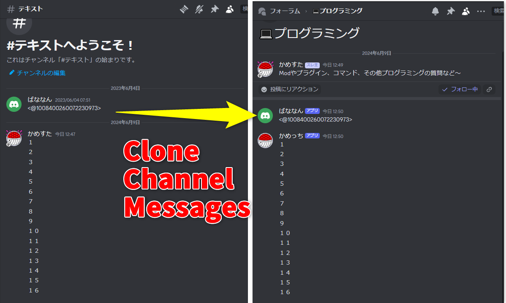

[English](README.md) | [日本語](README_ja.md)

# Discordチャンネルメッセージクローンツール

Discordのチャンネルを丸ごとコピーするツールです。
- チャンネル内のすべてのメッセージをコピーします。
    - チャンネル自体はコピーされません。Discordの機能を使って複製してください。
- メッセージ送信者の名前やアイコンが擬似的にコピーされます。(Webhookを使用しています)
- フォーラムスレッド内へのコピーも可能です。

## 必要な権限

- メッセージを取得するために Message Content Intent が必要です。
- Webhookを使用するため、サーバーにWebhookの作成権限が必要です。

## 使い方

1. `.env.sample` をコピーして `.env` という名前で保存します。
2. `.env` の `DISCORD_TOKEN` を自分のBotのトークンに書き換えます。
3. `npm install` で依存関係をインストールします。
4. `npm run start <コピー元のチャンネルID> <コピー先のチャンネルID>` でコピーを開始します。

### 途中でクローンが止まってしまったとき

途中でクローンが止まってしまった場合、以下の手順で途中から再開することができます。

1. 最後にコピーされたメッセージのIDを控えます。
2. `npm run start <コピー元のチャンネルID> <コピー先のチャンネルID> <最後にコピーされたメッセージのID>` で再開します。

## 制約

- スレッドやリアクションなどの情報はコピーできません
- Webhook APIの制約上、リプライ情報は保持されません
- ユーザー参加メッセージやブーストメッセージなどの特殊なメッセージはコピーできません
- メッセージ投稿日時はコピーされません

## ライセンス

このプロジェクトはMITライセンスの下で公開されています。詳細については[LICENSE](LICENSE)を参照してください。
